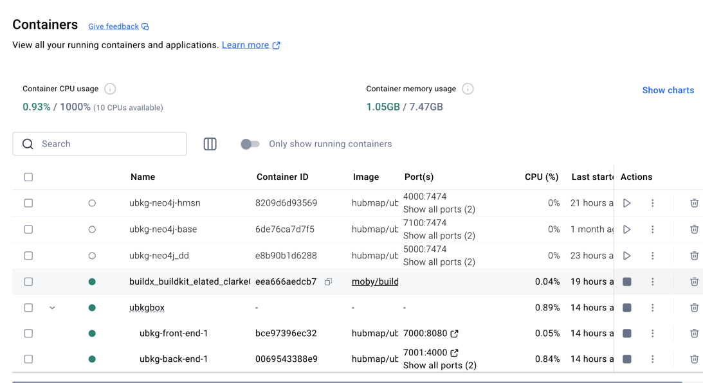

# Unified Biomedical Knowledge Graph (UBKG)

## Integrating ubkg-api into a UBKGBox deployment (ubkg-back-end)

**[UBKGBox](https://github.com/x-atlas-consortia/ubkg-box)** is a Docker Compose
multi-container application featuring:
- a **ubkg-back-end** service running an instance of a UBKG context in neo4j
- a **ubkg-front-end** service running a number of UBKG clients, including an instance of ubkg-api.

Scripts and Docker Compose YMLs in this directory can be used to build a distribution of **UBKGBox**.

# Supported platforms
The bash shell scripts contained in this directory are intended for use on Mac OS X or Linux. 
These scripts will not work on Windows. 
(The resulting Docker images should, however, run on Windows.)

# Workflow Setup

## Local UBKG neo4j Docker
The **ubkg-back-end** service of the **UBKGBox** application is a Docker container built from 
the turnkey UBKG neo4j process (_link after merge_).

## Files and directories

The **UBKGBox** Docker Compose configuration requires files and directories
from multiple GitHub repositories. Copy the files to the directory used to build the 
turnkey UBKG Docker distribution:

### docker-compose.yml
The **docker-compose.yml** file in the _/docker_ directory is used to 
generate the **UBKGBox** multi-container application.

### ubkg-api instance
The **ubkg-front-end** container hosts an instance of the ubkg-api which
is configured by an **app.cfg** file. Copy the entire _[instance](https://github.com/x-atlas-consortia/ubkg-api/tree/main/src/ubkg_api/instance)_ subdirectory
of the _/src/ubkg_api_ path in the ubkg-api repository.

The _instance_ directory should contain a file named **app.cfg**.
An **app.cfg** file can be created by copying from the file **app.cfg.example**.

The **app.cfg** file for the instance of ubkg-api in the **ubkg-front-end** service container
will, by default, not implement query management features of the ubkg-api, including:
- query timeout
- response payload size limitation
- S3 redirect of large payload

It is possible to configure the instance of the ubkg-api instance in the **ubkg-front-end** service container 
to manage queries by setting values of keys in the external **app.cfg** file. For instructions to configure
query management, consult the README.md in the ubkg-api repository, notably:
- [Optional Timeout Feature](https://github.com/x-atlas-consortia/ubkg-api/tree/main?tab=readme-ov-file#optional-timeout-feature)
- [Payload Size Limitation with Optional S3 Redirect](https://github.com/x-atlas-consortia/ubkg-api/tree/main?tab=readme-ov-file#payload-size-validation-with-optional-s3-redirection)

# Workflow

After building the local UBKG Docker container, execute

`docker compose up`

Docker Compose will build a container application named **ubkg_box*, with sub-containers named
- **ubkg-front-end-1**
- **ubkg-back-end-1**

