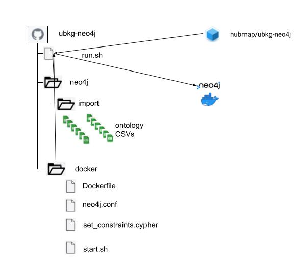
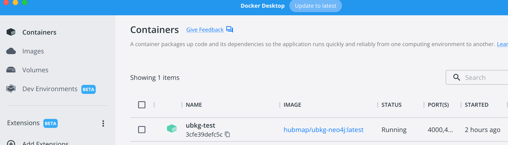
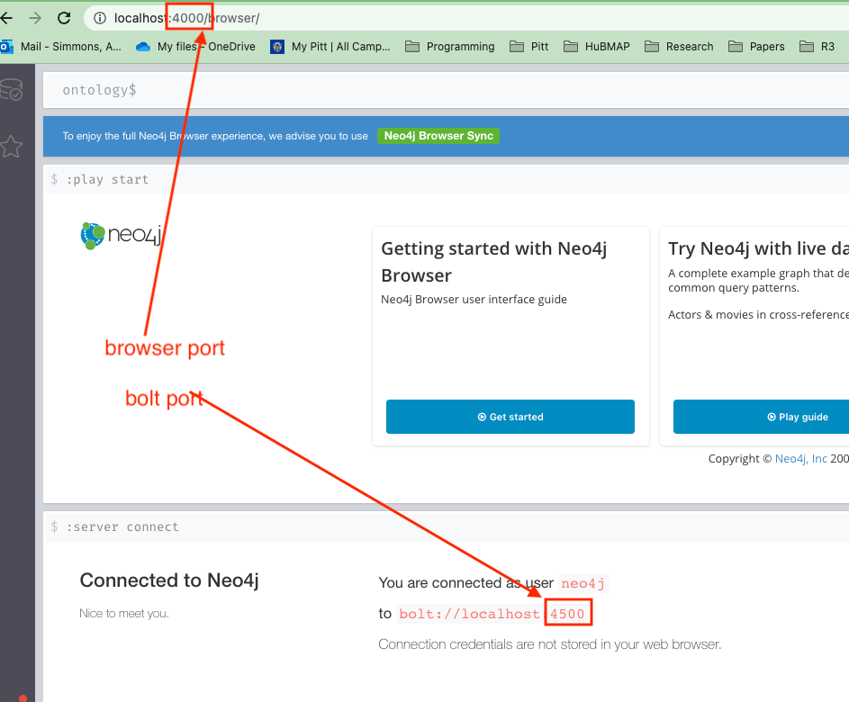

# Unified Biomedical Knowledge Graph (UBKG) Neo4j Docker support
This repository contains the source to build and run the Unified Biomedical ontology Knowledge Graph (UBKG) in Neo4j as a Docker container.

### Note on platform

This deployment was developed and tested using the following types of machines and platforms:
- Macbook Pros with the M1 chipset
- Red Hat Entrprise Linux (RHEL) 9 with an x86 architecture

Scripts in this repository  currently run on Linux or MacOS hosts. Scripts for Windows machines will be released soon.

---

## Quick start guide
To instantiate an instance of Neo4j with the UBKG by supplying a set of ontology CSVs, follow these steps: <br />

1. [Install and run Docker](https://docs.docker.com/engine/install/) on the host machine.
2. Download the [run.sh](https://raw.githubusercontent.com/x-atlas-consortia/ubkg-neo4j/main/run.sh) file from this repository or `git clone` this repository ([ubkg-neo4j](https://github.com/x-atlas-consortia/ubkg-neo4j)).  
3. Obtain a set of **ontology CSV files** to import into the **ontology** graph database in the Neo4j instance. (See **Ontology CSV files** below.) 
4. Copy the ontology CSVs to the directory **neo4j/import/** under the same directory where run.sh resides.
5. Run the script **run.sh** in a shell supplying a password for the admin account of the Neo4j instance,--e.g., `./run.sh -p <password>`, changing <password> to a secret password. Other options are available in the run.sh script. (See **The run.sh script** below for descriptions of options). 
6. **run.sh** will start a Docker container running neo4j with the default options. The Docker container will host an instance of Neo4j and populated it by importing from the ontology CSV files.  The process requires a few minutes.
7. Wait for the script to finish restarting Neo4j in read-only mode before trying to connect. (See **Example output of script** below for an example of the complete run of the script.)
8. Connect to the UBKG Neo4j Browser UI instance locally using http://localhost:_port_.
   * If you specified a value for _port_ in **run.sh** with the **-n** option, use that port. 
   * If you did not specify a value for _port_, use the default of 7474. 
9. The **Connect to Neo4j** screen will appear. In the **Connect URL** box,
   * Change the option to **bolt://**.
   * If you specified the bolt port in **run.sh** using the **-b** option, change the port; otherwise, use the default of 7687. 
10. Fill in the **Username**:
     * If you specified a username in **run.sh** using the **-u** option, provide that name.
     * If you did not specify a username, use the default of **neo4j**.
11. Fill in the **Password** that you specified with the **-p** option with **run.sh**.
12. Click **Connect**.
    

### Ontology CSV files

UBKG ontology CSV files contain licensed content extracted from the Unified Medical Language System ([UMLS](https://www.nlm.nih.gov/research/umls/index.html)).
The ontology CSV files cannot be published to public repositories, such as Github or Dockerhub. Prebuilt ontology CSVs are available for download, but require authorization because of licensing issues. 

For assistance with obtaining prebuilt ontology CSVs, contact the UBKG steward:

   [Jonathan Silverstein, MD](mailto:j.c.s@pitt.edu)

      
    Jonathan Silverstein, MD
    Department of Biomedical Informatics
    University of Pittsburgh

If you have the necessary UMLS licensing, you can generate a new set of ontology CSVs by using the scripts of the UBKG source and generation frameworks, as described in the [ubkg-etl](https://github.com/x-atlas-consortia/ubkg-etl) repository.

---

## The Ontology Knowledge Graph (UBKG)
The components of the UBKG include:

- The **source framework** that extracts ontology information from the UMLS to create a set of CSV files (**UMLS CSVs**)
- The **generation framework** that appends to the UMLS CSVs assertion data from other ontologies to create a set of **ontology CSVs**
- A neo4j  **ontology knowledge graph** populated from the ontology CSVs (this repository).
- An **API server** that provides RESTful endpoints to query the ontology knowledge graph.

For more details on the UBKG, consult the [documentation](https://ubkg.docs.xconsortia.org/).


## Files in the set of ontology CSVs 
1. CODE-SUIs.csv
2. CODEs.csv
3. CUI-CODEs.csv
4. CUI-CUIs.csv
5. CUI-SUIs.csv
6. CUI-TUIs.csv
7. CUIs.csv
8. DEFrel.csv
9. DEFs.csv
10. SUIs.csv
11. TUIrel.csv
12. TUIs.csv

---

## Building the UBKG Neo4j Docker image
Files to build the UBKG Neo4j Docker image are included in the `/docker/` directory of this repository.  This directory includes scripts to build and deploy the image to Docker Hub as well as a script to build a local image for development/debugging purposes. Information about building the image is in the [docker/README.md](https://github.com/x-atlas-consortia/ubkg-neo4j/blob/main/docker/README.md) file there.

---

## The run.sh Script

  ### Synopsis

  run.sh -p password [-d name] [-u usrname] [-c path] [-n port] [-b port] [-t tag] || -h

The **run.sh** script, when run with the minimum (**-p** option to set the password), will download the latest release UBKG Neo4j Docker image from Docker Hub, and run the container.  When the container starts up it will import the provided UBKG CSVs, apply Neo4j constraints and build indices, and then restart Neo4j in read-only mode.  At a minimum, to run the UBKG Neo4j Docker container, a password ust be supplied with the **-p** option and UBKG CSVs need to be provided in the directory `neo4j/import/` which exists in the same directory as run.sh.  If executed with the -h option only, help text will be shown.

Parameters are specified as options--i.e., in the format `-<option letter> <value>`.  All optional parameters, except -p, have default values.

| Parameter option | required | Description                                                                         | Default      |
|------------------|----------|-------------------------------------------------------------------------------------|--------------|
| -p                | yes      | password for the neo4j account                                                      |              |
| -d                | no       | name of the neo4j Docker container                                                  | ubkg-neo4j   |
| -u                | no       | the username used to connect to the neo4j database                                  | neo4j        |
| -c                | no       | the path to the directory in the local repository containing the ontology CSV files | neo4j/import |
| -n                | no       | the port to expose the **neo4j browser/UI** on                                      | 7474         |
| -b                | no       | the port to expose the **neo4j/bolt://** interface on                               | 7687         |
| -t                | no       | specify the tag to use  when running the container <br />use the value `local` to run local version built with the docker/build-local.sh script| <latest release version |
| -h                | no       | help                                                                                ||


#### Examples
```
./run.sh -p pwd
```
Creates a Docker container for an ontology database with password **pwd**, with defaults for all other parameters.
```
./run.sh -p pwd -u bob -n 9988 -d linda
```
Creates a Docker container named **linda** for an ontology database with an account named **bob** with password **pwd**, with the browser port of **9988**.



## Example output of script

The script was called on the local machine with options:

| option |description|value|
|--------|---|---|
|p|password|test|
|d|name of container|ubkg-test|
|n|browser port|4000|
|b|bolt port|4500|

```
jas971@jas971s-MBP docker % ./run.sh -p test -d ubkg-test -n 4000 -b 4500

```

### Validation
The script:
- validates parameters
- confirms that a full set of ontology CSV files are available

```
**********************************************************************
All 12 required ontology CSV files were found in directory '/Users/jas971/PycharmProjects/pythonProject/ubkg-neo4j/neo4j/import'.

A Docker container for a neo4j instance will be created using the following parameters:
  - container name:  ubkg-test
  - neo4j account name: neo4j
  - neo4j account password: test
  - CSV directory for ontology CSV files: /Users/jas971/PycharmProjects/pythonProject/ubkg-neo4j/neo4j/import
  - neo4j browser/UI port: 4000
  - neo4j bolt port: 4500
```

### Instantiating the Docker container

```
**************
Starting Docker container
Unable to find image 'hubmap/ubkg-neo4j:latest' locally
latest: Pulling from hubmap/ubkg-neo4j
7eb8632fc2b2: Pull complete 
9867c91448cc: Pull complete 
6fc50df23d40: Pull complete 
d8ea0c28c24a: Pull complete 
3d649c50064c: Pull complete 
4f4fb700ef54: Pull complete 
cd01416a9c68: Pull complete 
ebdc6c133b65: Pull complete 
Digest: sha256:3504a5fcf1ad86a804c442b58d6425b07d116e7eed959cfbdda01dd768e8af11
Status: Downloaded newer image for hubmap/ubkg-neo4j:latest
```

### Import of ontology CSV files
```
*****************************
Ontology neo4j start script
NEO4J_USER: neo4j
Setting the neo4j password as the value of NEO4J_PASSWORD environment variable: test
Changed password for user 'neo4j'.
Importing database from CSV files
neo4j 4.2.5
VM Name: OpenJDK 64-Bit Server VM
VM Vendor: Red Hat, Inc.
VM Version: 11.0.18+10-LTS
JIT compiler: HotSpot 64-Bit Tiered Compilers
VM Arguments: [-XX:+UseParallelGC, -Dfile.encoding=UTF-8]
Neo4j version: 4.2.5
Importing the contents of these files into /usr/src/app/neo4j/data/databases/ontology:
Nodes:
  [Concept]:
  /usr/src/app/neo4j/import/CUIs.csv

  [Semantic]:
  /usr/src/app/neo4j/import/TUIs.csv

  [Definition]:
  /usr/src/app/neo4j/import/DEFs.csv

  [Term]:
  /usr/src/app/neo4j/import/SUIs.csv

  [Code]:
  /usr/src/app/neo4j/import/CODEs.csv

Relationships:
  /usr/src/app/neo4j/import/CUI-CUIs.csv
  /usr/src/app/neo4j/import/CODE-SUIs.csv

  CODE:
  /usr/src/app/neo4j/import/CUI-CODEs.csv

  DEF:
  /usr/src/app/neo4j/import/DEFrel.csv

  STY:
  /usr/src/app/neo4j/import/CUI-TUIs.csv

  ISA_STY:
  /usr/src/app/neo4j/import/TUIrel.csv

  PREF_TERM:
  /usr/src/app/neo4j/import/CUI-SUIs.csv


Available resources:
  Total machine memory: 7.667GiB
  Free machine memory: 5.454GiB
  Max heap memory : 1.705GiB
  Processors: 5
  Configured max memory: 5.366GiB
  High-IO: true

Type normalization:
  Property type of 'value' normalized from 'float' --> 'double' in /usr/src/app/neo4j/import/CODEs.csv
  Property type of 'lowerbound' normalized from 'float' --> 'double' in /usr/src/app/neo4j/import/CODEs.csv
  Property type of 'upperbound' normalized from 'float' --> 'double' in /usr/src/app/neo4j/import/CODEs.csv
Nodes, started 2023-04-03 19:52:56.999+0000
[*Nodes:0B/s 1.160GiB-------------------------------------------------------------------------]21.2M ∆1.45M
Done in 30s 393ms
Prepare node index, started 2023-04-03 19:53:27.397+0000
[*DEDUPLICATE:1.240GiB------------------------------------------------------------------------]87.0M ∆44.5M
Done in 6s 272ms
DEDUP, started 2023-04-03 19:53:33.705+0000
[*DEDUP---------------------------------------------------------------------------------------]    0 ∆    0
Done in 169ms
Relationships, started 2023-04-03 19:53:33.876+0000
[*Relationships:0B/s 1.240GiB-----------------------------------------------------------------]55.8M ∆1.25M
Done in 1m 32s 353ms
Node Degrees, started 2023-04-03 19:55:06.316+0000
[*>(3)===========================================================|CALCULATE:1.194GiB----------]55.8M ∆10.0M
Done in 2s 259ms
Relationship --> Relationship 1-1791/1791, started 2023-04-03 19:55:08.649+0000
[>------------------------------|*LINK(2)=======================|v:150.9MiB/s-----------------]55.8M ∆4.26M
Done in 12s 82ms
RelationshipGroup 1-1791/1791, started 2023-04-03 19:55:20.746+0000
[*>:??---------------------------------------------------------------------------|v:??--------]3.05M ∆3.05M
Done in 567ms
Node --> Relationship, started 2023-04-03 19:55:21.331+0000
[>:??--|>-----------------------------------|LINK--|*v:??-------------------------------------]20.5M ∆20.5M
Done in 942ms
Relationship <-- Relationship 1-1791/1791, started 2023-04-03 19:55:22.316+0000
[>---------------------|*LINK(2)=======================================|v:139.3MiB/s----------]55.8M ∆5.51M
Done in 13s 325ms
Count groups, started 2023-04-03 19:55:35.688+0000
[>|*>------------------------------------------------------------------------|COUNT:1.036GiB--]3.05M ∆3.05M
Done in 207ms
Gather, started 2023-04-03 19:55:36.026+0000
[>----|*CACHE:1.302GiB------------------------------------------------------------------------]3.05M ∆2.22M
Done in 1s 48ms
Write, started 2023-04-03 19:55:37.083+0000
[*>:??----------------------------------------------------------------------------------||v:??]2.93M ∆2.93M
Done in 266ms
Node --> Group, started 2023-04-03 19:55:37.366+0000
[>--------------------------------|*FIRST----------------------------|v:??--------------------] 158K ∆ 158K
Done in 307ms
Node counts and label index build, started 2023-04-03 19:55:37.821+0000
[*>(2)==============================|LABEL INDEX---------------------|COUNT:1.155GiB----------]21.3M ∆11.8M
Done in 922ms
Relationship counts and relationship type index build, started 2023-04-03 19:55:38.764+0000
[*>--------------------------------------------------------|REL|COUNT(2)======================]55.8M ∆28.9M
Done in 3s 5ms

IMPORT DONE in 2m 45s 772ms. 
Imported:
  21283782 nodes
  55845544 relationships
  83145318 properties
Peak memory usage: 1.336GiB
There were bad entries which were skipped and logged into /usr/src/app/neo4j/bin/import.report
Start the neo4j server in the background...
Directories in use:
  home:         /usr/src/app/neo4j
  config:       /usr/src/app/neo4j/conf
  logs:         /usr/src/app/neo4j/logs
  plugins:      /usr/src/app/neo4j/plugins
  import:       /usr/src/app/neo4j/import
  data:         /usr/src/app/neo4j/data
  certificates: /usr/src/app/neo4j/certificates
  run:          /usr/src/app/neo4j/run

Starting Neo4j.
Started neo4j (pid 361). It is available at http://localhost:7474/
There may be a short delay until the server is ready.
```

### Setting of constraints and setting to read-only
```
See /usr/src/app/neo4j/logs/neo4j.log for current status.
Waiting for server to begin fielding Cypher queries...
Cypher Query available waiting...
Cypher Query available waiting...
Cypher Query available waiting...
Creating the constraints using Cypher queries...
0 rows available after 6401 ms, consumed after another 0 ms
Deleted 571070 nodes
0 rows available after 308 ms, consumed after another 0 ms
Added 1 constraints
0 rows available after 62 ms, consumed after another 0 ms
Added 1 constraints
0 rows available after 45 ms, consumed after another 0 ms
Added 1 constraints
0 rows available after 45 ms, consumed after another 0 ms
Added 1 constraints
0 rows available after 3906 ms, consumed after another 0 ms
Added 1 constraints
0 rows available after 4804 ms, consumed after another 0 ms
Added 1 constraints
0 rows available after 10 ms, consumed after another 0 ms
Added 1 indexes
0 rows available after 6 ms, consumed after another 0 ms
Added 1 indexes
0 rows available after 11034 ms, consumed after another 0 ms
Added 1 constraints
0 rows available after 14 ms, consumed after another 0 ms
Added 1 indexes
0 rows available after 774 ms, consumed after another 0 ms
Added 1 constraints
0 rows available after 16 ms, consumed after another 0 ms
Added 1 indexes
0 rows available after 10 ms, consumed after another 0 ms
Added 1 indexes
0 rows available after 84 ms, consumed after another 0 ms
Sleeping for 2m to allow the indexes to be built before going to read_only mode...
Stopping neo4j server to go into read_only mode...
Only allow read operations from this Neo4j instance...
Restarting neo4j server in read_only mode...
Directories in use:
  home:         /usr/src/app/neo4j
  config:       /usr/src/app/neo4j/conf
  logs:         /usr/src/app/neo4j/logs
  plugins:      /usr/src/app/neo4j/plugins
  import:       /usr/src/app/neo4j/import
  data:         /usr/src/app/neo4j/data
  certificates: /usr/src/app/neo4j/certificates
  run:          /usr/src/app/neo4j/run
Starting Neo4j.
2023-04-03 19:58:37.913+0000 INFO  Starting...
2023-04-03 19:58:38.862+0000 INFO  ======== Neo4j 4.2.5 ========
2023-04-03 19:58:42.301+0000 INFO  Performing postInitialization step for component 'security-users' with version 2 and status CURRENT
2023-04-03 19:58:42.301+0000 INFO  Updating the initial password in component 'security-users'  
2023-04-03 19:58:43.019+0000 INFO  Called db.clearQueryCaches(): Query cache already empty.
2023-04-03 19:58:43.049+0000 INFO  Bolt enabled on 0.0.0.0:7687.
2023-04-03 19:58:43.492+0000 INFO  Remote interface available at http://localhost:7474/
2023-04-03 19:58:43.492+0000 INFO  Started.

```
### Result in Docker Desktop


### Result in browser



