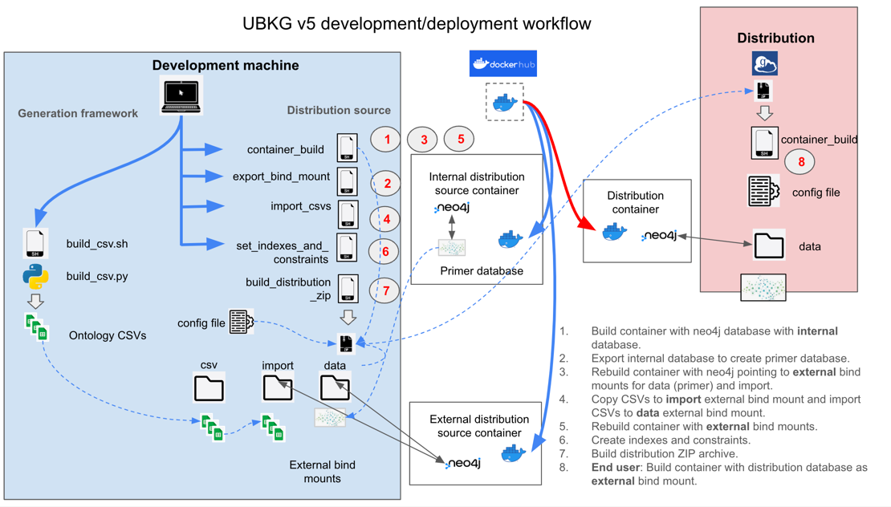

# Unified Biomedical Knowledge Graph (UBKG) 

# Instructions for building the Docker neo4j Distribution

Building a UBKG distribution involves a complicated workflow that generates a
neo4j database as an external bind mount for a Docker container that hosts
an instance of neo4j.

# Background
## Goals
The goals of the development infrastructure include:
1. Encapsulating workflow functions in modular shell scripts.
2. Keeping ontology CSVs of licensed content out of public Docker containers.
3. Using a build script that can be used for both build and deployment.
4. Optimizing deployment by generating all indexes and constraints at build time.
5. Keeping the end user's actual deployment as simple as possible.

## Basic workflow
The objective of the build workflow is to build a complete and performant UBKG neo4j database that 
will not be contained in the public Docker image. To acheive this objective, the workflow:
- starts with the empty default database that is part of the installation of neo4j
- uses this database as a primer
- exports the primer database to be an external bind mount of a Docker container
- converts the primer database into a UBKG database by importing ontology CSVs into the primer
- creates indexes and constraints in the UBKG database

The following image illustrates the workflow.


# Prerequisites for building

## Set up host machine
The host machine's specifications include:
- Mac OSX or Linux 
- Minimum of 32 GB RAM
- Free disk space equal to 3-4 times the size of the set of ontology CSVs
- Docker installed
- git installed
- a git clone of the **ubkg-neo4j** repository

## Obtain Ontology CSVs
Use the **generation framework** infrastructure (ETL) in the 
[ubkg-etl](https://github.com/x-atlas-consortia/ubkg-etl) repository to generate a set of **ontology CSVs**.

# ubkg-neo4j Repository content
## docker directory
The **docker** directory contains source used to build a Docker image that will be published in Docker Hub.
Refer to the README.md file in **docker** for more information.

## scripts
The **scripts** folder contains:
- the set of shell scripts used in the workflow
- **container.cfg.example**, the archetype of the config file used by the scripts

# Build distribution source directory
1. Create a new directory on the host machine. Copy to this directory the following files:
- **build_container.sh**
- **export_bind_mount.sh**
- **import_csvs.sh**
- **set_indexes_and_constraints.sh**
- **build_distribution_zip.sh**
- **container.cfg.example**
2. Create a directory named **csv**. 
3. Copy the ontology CSVs into the **csv** folder.

# Edit configuration file
Each of the scripts in the build workflow depend on the same configuration file.

Copy **container.cfg.example** to a file named **container.cfg**. (Files with extension *.cfg are ignored by .gitignore.)

Uncomment and edit variables in the configuration file as necessary.

| Value          | Purpose                                                   | Recommendation                                                                                                                                                                                         |
|----------------|-----------------------------------------------------------|--------------------------------------------------------------------------------------------------------------------------------------------------------------------------------------------------------|
| container_name | Name of the Docker container                              | accept default                                                                                                                                                                                         |
| docker_tag     | Tag for the Docker container                              | If you are modifying the Docker image and have built a local image with **build-local.sh**, set *docker_tag=local*; otherwise, accept the default, which is name of the published image in Docker Hub. |
| neo4j_password | Password for the neo4j user                               | minimum of 8 characters, including at least one letter and one number                                                                                                                                  |
| ui_port        | Port used by the neo4j browser                            | number other than 7474 to prevent possible conflicts with local installations of neo4j                                                                                                                 |
| bolt_port      | Port used by neo4j bolt (Cypher)                          | number other than 7687 to prevent possible conflicts with local installations of neo4j                                                                                                                 |
| read_mode      | Whether the neo4j database is *read-only* or *read-write* | Because you will be writing to the database, set *read_mode=read-write*.                                                                                                                               |
| db_mount_dir   | Path to the external neo4j database  (bind mount)         | accept default (/data)                                                                                                                                                                                 |
| csv_dir        | Path to the folder that contains the ontology CSVs        | accept default                                                                                                                                                                                         |

# Execute workflow
## 1. Build Docker container hosting neo4j with internal primer database.

1. Open a Terminal window. 
2. Navigate to the distribution source directory.
3. Execute `./build_container.sh internal`

The **build_container.sh** script:
- pulls a Docker image--either from Docker Hub or from a local image that you built with **build-local.sh**
- creates a Docker container
- configures the neo4j server inside the Docker container

The full syntax for the call to the script is
```./build_container.sh <mode> -c <config file name>```

The *mode* argument can be one of the following:

| mode     | result                                                                                                     |
|----------|------------------------------------------------------------------------------------------------------------|
| internal | builds a Docker container hosting a completely contained neo4j server                                      |
| external | builds a Docker container hosting a neo4j server with bind mounts to:<br/>- data<br/> - import<br/> - logs |
| h        | displays help                                                                                              |

The script's default values are:
- *mode*: **external**.
- c: **container.cfg**

The **build_container.sh** will run for a short time (1-2 minutes), and will be finished when it displays a message similar to `[main] INFO org.eclipse.jetty.server.Server - Started Server@16fa5e34{STARTING}[10.0.15,sto=0] @11686ms`
Because the script runs neo4j Console, you will not be able to execute CLI commands in the Terminal window.


At this point, you should be able to open a browser and connect to the neo4j instance using the connection parameters 
that you set in the configuration file. The instance will be empty.

## 2. Export the internal neo4j database to create primer database.

1. Open another Terminal window and navigate to the distribution source directory.
2. Execute `export_bind_mount.sh`
3. The **export_bind_mount.sh** script exports the *\data* folder inside the Docker container that you created earlier to the location specified by **db_mount_dir** in the config file.

## 3. Rebuild Docker container with neo4j pointing to external bind mounts.

In the same Terminal window in which you executed **export_bind_mount.sh**, execute `.\build_container.sh external`. 
**build_container.sh** will create a new Docker container with name, tag, and connection properties as the original container. 
The new container will have *external bind mounts* to the following directories:
- **data**
- **import**
- **logs**

## 4. Copy CSVs to import external bind mount and import CSVs to data external bind mount.
1. Return to the first Terminal session. Because the execution of **build_container.sh** in the second Terminal session closed the original Docker container, you can now execute commands in this session.
2. Execute `./import_csvs.sh`

The **import_csvs.sh** script:
- Copies the ontology CSVs from the folder specified by **csv_dir** in the config file to the new *import* bind mount directory.
- Runs the **neo4j-admin import** utility to import the ontology CSVs into the neo4j database in the *data* bind mount directory.
- Exports to the distribution source directory the **import.report** file generated by neo4j-admin import to track import issues.

### Notes on the import script
1. As described [here](https://docs.docker.com/storage/bind-mounts/#mount-into-a-non-empty-directory-on-the-container), a bind mount on a non-empty directory can result in Docker "obscuring" the files that were in the directory. This is the case for the *import* bind mount, but not for the *data* bind mount. For this reason, the script copies CSVs into the *import* bind mount after it is created.
2. The script explicitly sets the maximum heap memory instead of relying on neo4j to allocate heap memory via heuristics. Without the explicit allocation, neo4j will overallocate the maximum heap memory, which results in memory swapping and slow imports. See [this Stack Overflow post](https://stackoverflow.com/questions/58808877/set-heap-memory-for-neo4j-admin-import?rq=2) for details, which includes comments that I contributed. 
3. The import will take some time--on the order of minutes, not hours.

## 5. Rebuild Docker container with external bind mounts.
Execute `./build_container.sh external`
This will rebuild the Docker container with external bind mounts, including to the **data** directory that now contains a new neo4j database built from importing the ontology CSVs.

At this point, you should be able to open a browser and connect to the neo4j instance using the connection parameters 
that you set in the configuration file. The instance will contain the UBKG nodes and edges, but without indexes or constraints.

## 6. Create indexes and constraints.
1. Switch to the second Terminal session.
2. Execute `/.set_indexes_and_constraints.sh`

The **set_indexes_and_constraints.sh** script executes a series of Cypher statements in the file 
named **indexes_constraints.cypher**, which is located inside the Docker container. The statements in the Cypher file
create relationship indexes for almost every type of relationship in the UBKG, with the following exceptions that result in syntax errors in Cypher:
- relationship types that contain special characters (except for underscore)
- relationship types that begin with numbers

### Monitoring index creation
Because of the large number of relationship types in the UBKG, the creation of the 
relationship indexes will take some time, even though the **set_indexes_and_constraints** script completes. 
For example, the HuBMAP/SenNet deployment of the UBKG contains over 1800 relationships; neo4j requires around 30 minutes to create all the relationship indexes.

Wait until all indexes are created before moving to the next step in the workflow. If index creation is interrupted, the database can be corrupted.

To monitor the progress of relationship index creation, you can execute the following Cypher statement:
`SHOW INDEXES WHERE populationPercent < 100`.
Index creation is complete when no indexes are returned.

## 7. Build the distribution Zip.

Once you are assured that index creation is complete and no other transactions are occurring in the neo4j instance, execute `./build_distribution_zip.sh`

The **build_distribution_zip.sh** script:
- stops the Docker container, which should result in a graceful shutdown of the neo4j server
- creates a zip file with the same name as the Docker container, containing the files for the distribution

## 8. Upload the distribution Zip.

Upload the distribution Zip to a folder in a Globus collection.

