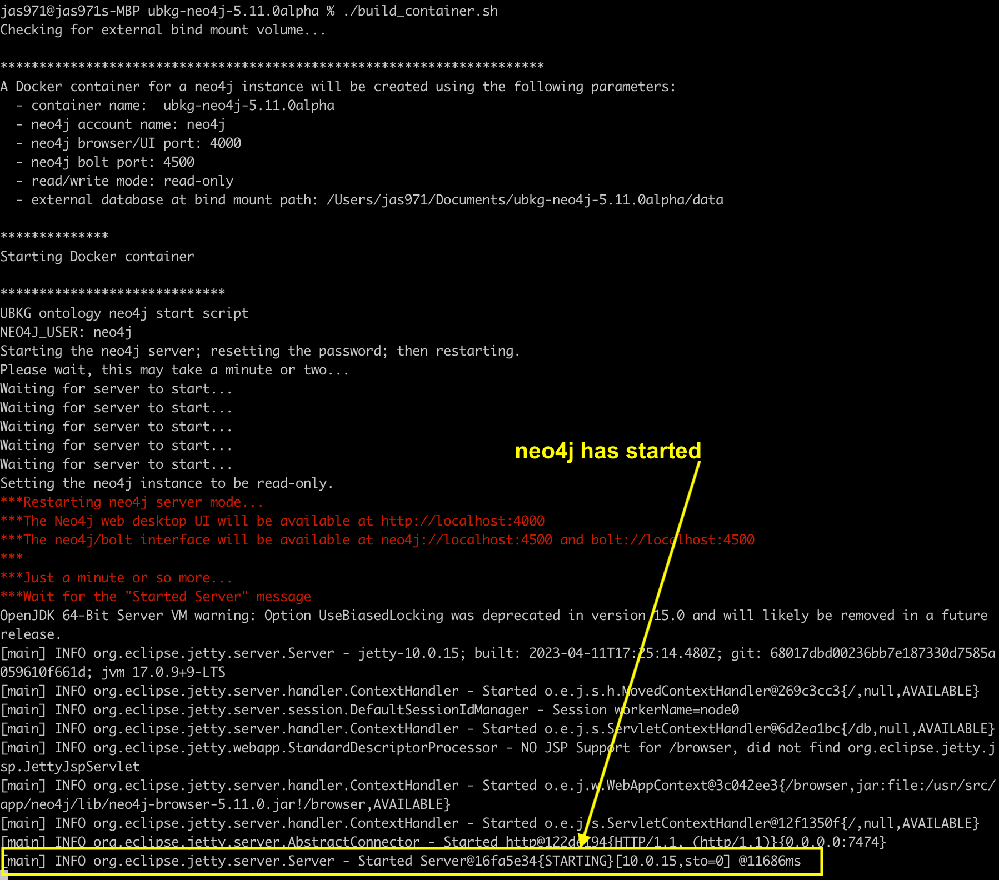

# Unified Biomedical Knowledge Graph (UBKG) 

# Instructions for building the Docker neo4j Distribution

Building a UBKG distribution involves a complicated workflow that generates a
neo4j database as an external bind mount for a Docker container that hosts
an instance of neo4j.

# Background
## Goals
The goals of the development infrastructure include:
1. Encapsulating workflow functions in modular shell scripts.
2. Keeping ontology CSVs of licensed content out of public Docker containers.
3. Using a build script that can be used for both build and deployment.
4. Optimizing deployment by generating all indexes and constraints at build time.
5. Keeping the end user's actual deployment as simple as possible.

## Basic workflow
The objective of the build workflow is to build a complete and performant UBKG neo4j database that 
will not be contained in the public Docker image. To acheive this objective, the workflow:
- starts with the empty default database that is part of the installation of neo4j
- uses this database as a primer
- exports the primer database to be an external bind mount of a Docker container
- converts the primer database into a UBKG database by importing ontology CSVs into the primer
- creates indexes and constraints in the UBKG database

The following image illustrates the workflow.


# Prerequisites for building

## Set up host machine
The host machine's specifications include:
- Mac OSX or Linux 
- Minimum of 32 GB RAM
- Free disk space equal to 3-4 times the size of the set of ontology CSVs
- Docker installed
- git installed
- a git clone of the **ubkg-neo4j** repository

### Python
The workflow includes the optional execution of a Python script for the synchronous creation of indexes and constraints
in the neo4j instance of UBKG. (**create_indexes_and_constraints.py** - See discussion below)
Although optional, this is the default architecture.

If the Python script will be used, install Python 3 on the development machine.
The **create_indexes_and_constraints.sh** script will establish a Python virtual environment for the 
**create_indexes_and_constraints.py** script.

The index creation architecture was developed on a MacBook Pro M1 running MacOs Ventura. 
The **create_indexes_and_constraints.sh** script assumes a MacOs environment for tasks such as installing packages etc.

### Java max heap memory recommendations
The recommended values for Java max heap memory in the configuration file depend on the stage of the workflow.

The recommendations are based on the following use case:
1. Developer machine: 
   - MacBook Pro
   - Apple M1 Max processor
   - 32 GB RAM
2. Docker
3. neo4j server
   - Community Edition
   - v 5.11
4. 27 GB UBKG database (Data Distillery)

If your use case differs, obtain recommendations using neo4j-admin as shown in the **source** column.

| Workflow            | Recommended Java Heap memory | source                                   |
|---------------------|------------------------------|------------------------------------------|
| import of CSVs      | -Xms1.003g -Xmx1.003g        | neo4j-admin import                       |
| creation of indexes | -Xms3.500g -Xmx3.500g        | neo4j-admin server memory-recommendation |

## Obtain Ontology CSVs
Use the **generation framework** infrastructure (ETL) in the 
[ubkg-etl](https://github.com/x-atlas-consortia/ubkg-etl) repository to generate a set of **ontology CSVs**.

### RELEASE.csv
The RELEASE.csv is a simple CSV that describes the content of the UBKG. The format of the CSV should be self-evident 
from the column headers. Build a RELEASE.csv file per release and include with the 12 other ontology CSVs.

# ubkg-neo4j Repository content
## docker directory
The **docker** directory contains source used to build a Docker image that will be published in Docker Hub.
Refer to the README.md file in **docker** for more information.

## scripts
The **scripts** folder contains:
- the set of Shell scripts (and optional Python scripts) used in the workflow
- **container.cfg.example**, the archetype of the config file used by the scripts

# Build distribution source directory
1. Create a new directory on the host machine. Copy to this directory the following files:
- **build_container.sh**
- **export_bind_mount.sh**
- **import_csvs.sh**
- **set_indexes_and_constraints.sh**
- **build_distribution_zip.sh**
- **container.cfg.example**
- the **python** directory (if indexes and constraints will be created synchonously)
2. Create a directory named **csv**. 
3. Copy the ontology CSVs into the **csv** folder.

# Edit configuration file
Each of the scripts in the build workflow depend on the same configuration file.

Copy **container.cfg.example** to a file named **container.cfg**. (Files with extension *.cfg are ignored by .gitignore.)

Uncomment and edit variables in the configuration file as necessary.

| Value          | Purpose                                                                 | Recommendation                                                                                                                                                                                         |
|----------------|-------------------------------------------------------------------------|--------------------------------------------------------------------------------------------------------------------------------------------------------------------------------------------------------|
| container_name | Name of the Docker container                                            | accept default                                                                                                                                                                                         |
| docker_tag     | Tag for the Docker container                                            | If you are modifying the Docker image and have built a local image with **build-local.sh**, set *docker_tag=local*; otherwise, accept the default, which is name of the published image in Docker Hub. |
| neo4j_password | Password for the neo4j user                                             | minimum of 8 characters, including at least one letter and one number                                                                                                                                  |
| ui_port        | Port used by the neo4j browser                                          | number other than 7474 to prevent possible conflicts with local installations of neo4j                                                                                                                 |
| bolt_port      | Port used by neo4j bolt (Cypher)                                        | number other than 7687 to prevent possible conflicts with local installations of neo4j                                                                                                                 |
| read_mode      | Whether the neo4j database is *read-only* or *read-write*               | Because you will be writing to the database, set *read_mode=read-write*.                                                                                                                               |
| db_mount_dir   | Path to the external neo4j database  (bind mount)                       | accept default (/data)                                                                                                                                                                                 |
| csv_dir        | Path to the folder that contains the ontology CSVs                      | accept default                                                                                                                                                                                         |
| heap_import    | Max Java heap memory size for importing CSVs                            | accept default                                                                                                                                                                                         |
| heap_indexing  | Max Java heap memory size for creating indexes and constraints in neo4j | accept default                                                                                                                                                                                         |

# Execute workflow
## The need for multiple Terminal sessions
The workflow will require the use of two Terminal sessions, with switching between sessions. 
This is a consequence of the complex interaction between the **build_container.sh** script, the Dockerfile, and the **start.sh** script. 
The execution of a step involving **build_container.sh** must remain active until the Docker container has completely started, evidence of which is something of a mystery.

## 1. Build Docker container hosting neo4j with internal primer database.

1. Open a Terminal window. 
2. Navigate to the distribution source directory.
3. Execute `./build_container.sh internal`

The **build_container.sh** script:
- pulls a Docker image--either from Docker Hub or from a local image that you built with **build-local.sh**
- creates a Docker container
- configures the neo4j server inside the Docker container

The full syntax for the call to the script is
```./build_container.sh <mode> -c <config file name>```

The *mode* argument can be one of the following:

| mode     | result                                                                                                     |
|----------|------------------------------------------------------------------------------------------------------------|
| internal | builds a Docker container hosting a completely contained neo4j server                                      |
| external | builds a Docker container hosting a neo4j server with bind mounts to:<br/>- data<br/> - import<br/> - logs |
| h        | displays help                                                                                              |

The script's default values are:
- *mode*: **external**.
- c: **container.cfg**

The **build_container.sh** will run for a short time (1-2 minutes), and will be finished when it displays a message similar to `[main] INFO org.eclipse.jetty.server.Server - Started Server@16fa5e34{STARTING}[10.0.15,sto=0] @11686ms`
Because the script runs neo4j Console, you will not be able to execute additional CLI commands in the Terminal window.



At this point, you should be able to open a browser and connect to the neo4j instance using the connection parameters 
that you set in the configuration file. The instance will be empty.

## 2. Export the internal neo4j database to create primer database.

1. Open another Terminal window and navigate to the distribution source directory.
2. Execute `./export_bind_mount.sh`
3. The **export_bind_mount.sh** script exports the *\data* folder inside the Docker container that you created earlier to the location specified by **db_mount_dir** in the config file.

## 3. Rebuild Docker container with neo4j pointing to external bind mounts.

In the same Terminal window in which you executed **export_bind_mount.sh**, execute `.\build_container.sh external`. 
**build_container.sh** will create a new Docker container with name, tag, and connection properties as the original container. 
The new container will have *external bind mounts* to the following directories:
- **data**
- **import**
- **logs**

## 4. Copy CSVs to import external bind mount and import CSVs to data external bind mount.
1. Return to the first Terminal session, which will now accept input. Because the execution of **build_container.sh** in the second Terminal session closed the original Docker container, you can now execute commands in this session.
2. Execute `./import_csvs.sh`

The **import_csvs.sh** script:
- Copies the ontology CSVs from the folder specified by **csv_dir** in the config file to the new *import* bind mount directory.
- Runs the **neo4j-admin import** utility to import the ontology CSVs into the neo4j database in the *data* bind mount directory.
- Exports to the distribution source directory the **import.report** file generated by neo4j-admin import to track import issues.

### Notes on the import script
1. As described [here](https://docs.docker.com/storage/bind-mounts/#mount-into-a-non-empty-directory-on-the-container), a bind mount on a non-empty directory can result in Docker "obscuring" the files that were in the directory. This is the case for the *import* bind mount, but not for the *data* bind mount. For this reason, the script copies CSVs into the *import* bind mount after it is created.
2. The script explicitly sets the maximum heap memory instead of relying on neo4j to allocate heap memory via heuristics. Without the explicit allocation, neo4j will overallocate the maximum heap memory, which results in memory swapping and slow imports. See [this Stack Overflow post](https://stackoverflow.com/questions/58808877/set-heap-memory-for-neo4j-admin-import?rq=2) for details. 
3. The import will take some time--however, on the order of minutes, not hours.

## 5. Rebuild Docker container with external bind mounts.
Execute `./build_container.sh external`
This will rebuild the Docker container with external bind mounts, including to the **data** directory that now contains a new neo4j database built from importing the ontology CSVs.

At this point, you should be able to open a browser and connect to the neo4j instance using the connection parameters 
that you set in the configuration file. The instance will contain the UBKG nodes and edges, but without indexes or constraints.

## 6. Create indexes and constraints.
1. Switch to the second Terminal session, which will now accept input.
2. Execute `./create_indexes_and_constraints.sh`

### Memory considerations
Both the asynchronous (native Cypher) and synchronous (Python) index architectures execute a series of Cypher commands
that create relationship indexes on all relationships in the UBKG.

In general, a UBKG implementation will contain a large number of different 
relationship types (e.g., 1800). The script will result in a significant
processing load. Because index creation in neo4j is
asynchronous by default, creating all indexes at once with
asynchronous native Cypher commands results in a large number of parallel threads.

If the UBKG database is large, creating a large number of indexes asynchronously
will likely result in a Java Out of Memory Error (OOME) by
exceeding the Java max heap memory. This will be reflected in the **debug.log** of the neo4j
instance (available in the **logs** external bind mount) with messages such as
```
2024-01-11 01:51:26.529+0000 ERROR [o.n.k.i.a.i.IndexPopulationJob] [neo4j/947a8a6c] Failed to populate index: [Index( id=1198, name='rSAB_coexpression_Colon___Transverse', type='RANGE', schema=()-[:coexpression_Colon___Transverse {SAB}]-(), indexProvider='range-1.0' )]
java.lang.OutOfMemoryError: Java heap space
```
To mitigate the risk of OOMEs,
a Python script (**create_indexes_and_constraints.py**) executes the
index creation statements synchronously.

Use the asynchronous option (**indexing=synchronous** in the configuration file) only if the 
implementation of UBKG is relatively small (around 10 GB).

### Filtering for relationship types
The Cypher statments create relationship indexes for almost every type of relationship in the UBKG, 
with the following exceptions that violate [neo4j naming rules](https://neo4j.com/docs/cypher-manual/current/syntax/naming/):
- relationship types that contain special characters (except for underscore)
- relationship types that begin with numbers


To avoid excluding relationships from a relationship index, name relationships using only alphanumeric characters and underscores.
The UBKG generation framework ETLs automatically reformats relationship names that violate neo4j naming rules.

### Deletion of NOCODE codes
The ontology CSVs from UMLS include 6 codes with CodeID of NOCODE, corresponding to Metathesaurus NOCODE codes
that the UMLS defines for concepts that have no codes in any source vocabulary. Two of these NOCODE codes have thousands
of relationships. The **create_constraints_and_node_indexes.cypher** deletes these codes via a call to APOC. These codes
must be removed before indexes are created.


### Monitoring index creation 
#### General
Because of the large number of relationship types in the UBKG, the creation of the 
relationship indexes will take some time. Example generation times:
- HuBMAP/SenNet: 30 minutes
- Data Distillery: 120 minutes

#### in neo4j
To monitor the progress of relationship index creation, you can execute the following Cypher statement:
`SHOW INDEXES WHERE populationPercent < 100`.
Index creation is complete when no indexes are returned.

#### in the Python script
The Python script displays progress indicators.

**Wait until all indexes are created before moving to the next step in the workflow. If index creation is interrupted, the database can be corrupted.**

## 7. Build the distribution Zip.

Once you are assured that index creation is complete and no other transactions are occurring in the neo4j instance, execute `./build_distribution_zip.sh`

The **build_distribution_zip.sh** script:
- Explicitly shuts down the neo4j service inside the Docker container. This should prevent a 137 error (killed process) in the next step.
- Stops the Docker container.
- Creates a zip file with the same name as the Docker container, containing the files for the distribution.

## 8. Upload the distribution Zip.

Upload the distribution Zip to a folder in a Globus collection.

