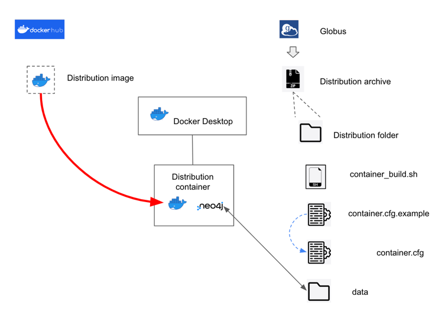
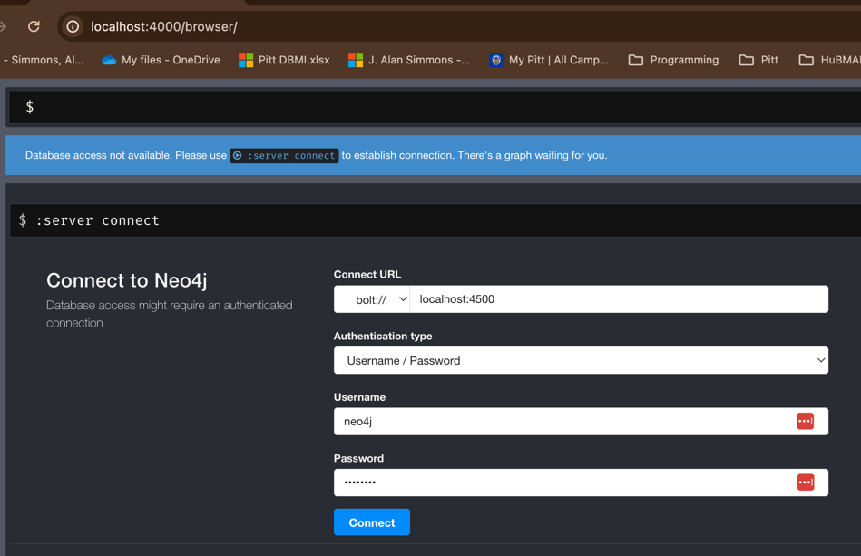

# Unified Biomedical Knowledge Graph (UBKG) 

# Instructions for deploying the Docker neo4j Distribution

# Prerequisites
## Access
1. Obtain access to the Globus collection in which the distribution is stored. (Refer to the main README for details on obtaining access.)
2. Download the distribution Zip archive, using Globus Connect Personal.


## Host machine
1. Install [Docker](https://docs.docker.com/engine/install/) on the host machine.
2. The host machine will require considerable disk space, depending on the distribution. As of December 2023, distribution sizes were around:
   - HuBMAP/SenNet: 9GB
   - Data Distillery: 20GB 

# Simple Deployment
This deployment uses default settings. 



1. Expand the Zip archive. The expanded distribution directory will contain:
   - a directory named **Data**. This directory contains the UBKG neo4j database files.
   - a script named **build_container.sh**. This script builds a Docker container hosting the UBKG instance of neo4j.
   - **container.cfg.example**. This is an annotated example of the configuration file required by **build_container.sh**.
2. Copy **container.cfg.example** to a file named **container.cfg**.
3. Start Docker Desktop.
4. Open a Terminal session.
5. Move to the distribution directory.
6. Execute `./build_container.sh`.
7. The **build_container.sh** will run for a short time (1-2 minutes), and will be finished when it displays a message similar to ```[main] INFO org.eclipse.jetty.server.Server - Started Server@16fa5e34{STARTING}[10.0.15,sto=0] @11686ms```


The **build_container.sh** will create a Docker container with the following default properties:

| Property       | Value                   |
|----------------|-------------------------|
| container name | ubkg-neo4j-<*version*>  |
| image name     | hubmap/ubkg-neo4j       |
| image tag      | current-release         |
| ports          | 4000:7474<br/>4500:7687 |
| read-write|read-only|


8. Open a browser window. Enter `http://localhost:4000/browser/`. 
9. The neo4j browser window will appear. Enter connection information:

| Property            | Value                 |
|---------------------|-----------------------|
| Connect URL         | bolt://localhost:4000 |
| Authentication Type | Username/Password     |
| Username            | neo4j                 |
| Password            | abcd1234              |


10. Select **Connect**. 

# Custom Deployment
## Changes to Docker configuration
To modify the Docker configuration, change values in the configuration file.
Keeping the value commented results in the script using a default value.

| Value          | Purpose                                                   | Recommendation                                                                         |
|----------------|-----------------------------------------------------------|----------------------------------------------------------------------------------------|
| container_name | Name of the Docker container                              | accept default                                                                         |
| docker_tag     | Tag for the Docker container                              | accept default                                                                         |
| neo4j_password | Password for the neo4j user                               | minimum of 8 characters, including at least one letter and one number                  |
| ui_port        | Port used by the neo4j browser                            | number other than 7474 to prevent possible conflicts with local installations of neo4j |
| bolt_port      | Port used by neo4j bolt (Cypher)                          | number other than 7687 to prevent possible conflicts with local installations of neo4j |
| read_mode      | Whether the neo4j database is *read-only* or *read-write* | accept default (read-only)                                                             |
| db_mount_dir   | Path to the external neo4j database                       | accept default (/data)                                                                 |
| all others     | Not used for deployment; values will be ignored           | accept default                                                                         |

## Rename configuration file
To specify another configuration file, execute the command ```/.build_container.sh external -c <your configuration file>```