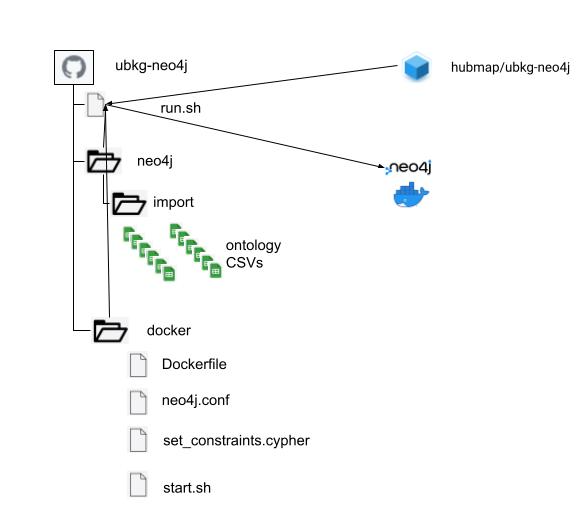
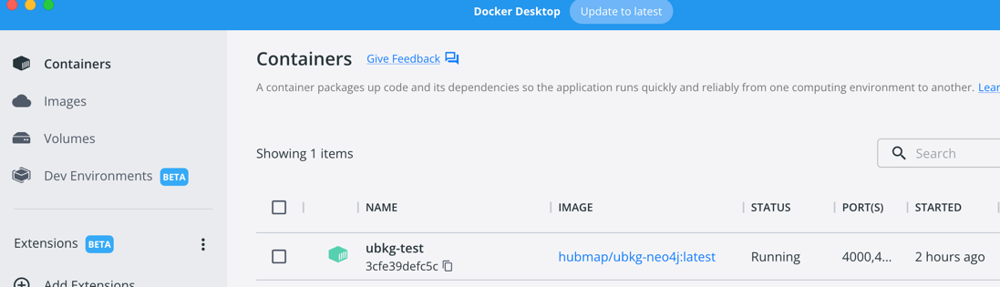
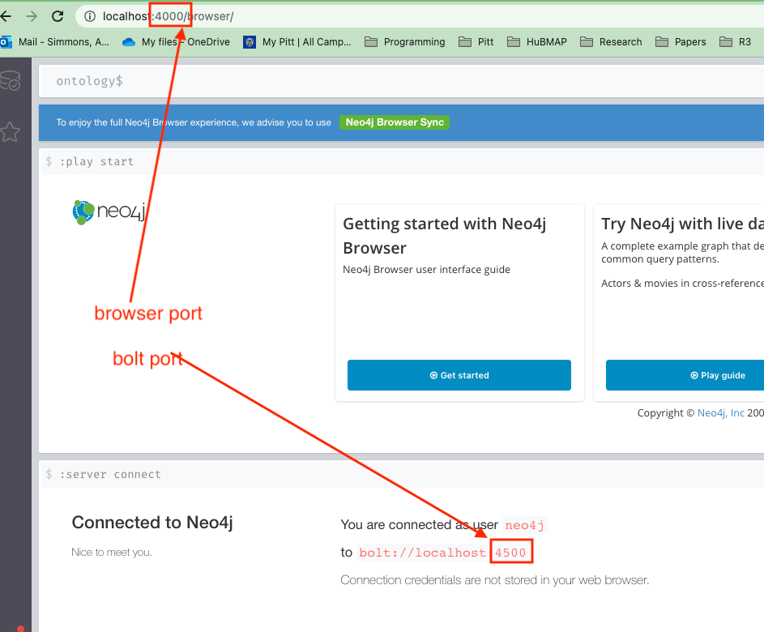

# Unified Biomedical Knowledge Graph (UBKG) Neo4j Docker support
This repository contains the source to build and run the Unified Biomedical ontology Knowledge Graph (UBKG) in Neo4j as a Docker container.

The run5.sh script provided here will launch a Docker container which runs an instance of Neo4j connected to a provided database.

### Note about supported platforms:
The current release was developed and tested on Mac OS X with M1 and Linux with x86-64 arcitecture.<br />
The release *should* work on OS X with Intel or M2 processors and any Linux release supported by Docker.<br />
The run5.sh script documented below was developed to work on OS X or Linux, a run script for Windows will be available soon.

---
## Quick start guide
To run an instance of Neo4j 5.11.0 with the UBKG by supplying a pre-built database follow these steps: <br />

1. [Install and run Docker](https://docs.docker.com/engine/install/) on the host machine.
2. Open a command line shell (needed for following steps too) then create a directory where you will host the database from- e.g.:
```
cd /myuserdir/myprojectdir/
mkdir ubkg-neo`
```
3. Download the [run5.sh](https://raw.githubusercontent.com/x-atlas-consortia/ubkg-neo4j/shirey/update-to-5.x/run5.sh) file from this repository or `git clone` this repository ([ubkg-neo4j](https://github.com/x-atlas-consortia/ubkg-neo4j)).  e.g.:
```
wget https://raw.githubusercontent.com/x-atlas-consortia/ubkg-neo4j/shirey/update-to-5.x/run5.sh
```
4. Obtain a set of **ontology Neo4j database files** (see section **Ontology Database Files** section below)
5. Unpack the the database in the `neo4j/` directory e.g.:
```
mkdir neo4j
cd neo4j
unzip ../ubkg-neo4j5.zip
cd ../
```
This should unpack the database into a directory `data/` to create the required, default, direcotry neo4j/data/ that contains the UBKG Neo4j database files.
6. Run the script **run5.sh** in a shell supplying the password for the admin account of the Neo4j instance,--e.g. (change <password> to a secret password of your choosing, the password must be a minimum of 8 characters long containing a minimum of one number and one alpabetic character):
```
./run5.sh -p <password>
```
Other options are available in the run5.sh script. (See **The run5.sh script** below for descriptions of options or run `./run5.sh -h` for help content). 
6. **run5.sh** will start a Docker container running neo4j with the default options. The Docker container will host an instance of Neo4j and populated it by importing from the ontology CSV files.  The process requires a few minutes.
7. Wait for the script to finish restarting Neo4j in read-only mode before trying to connect. (See **Example output of script** below for an example of the complete run of the script.)
8. Connect to the UBKG Neo4j Browser UI instance locally using http://localhost:_port_.
   * If you specified a value for _port_ in **run5.sh** with the **-n** option, use that port. 
   * If you did not specify a value for _port_, use the default of 7474. 
9. The **Connect to Neo4j** screen will appear. In the **Connect URL** box,
   * Change the option to **bolt://**.
   * If you specified the bolt port in **run5.sh** using the **-b** option, change the port; otherwise, use the default of 7687.
10. Specify the default username of `neo4j` (currently the username cannot be changed in the run script)
11. Fill in the **Password** that you specified with the **-p** option with **run5.sh**.
12. Click **Connect**.
    
### Ontology Database files
UBKG ontology database files contain licensed content extracted from the Unified Medical Language System ([UMLS](https://www.nlm.nih.gov/research/umls/index.html)).
These database  files cannot be published to public repositories, such as Github or Dockerhub. Prebuilt ontology CSVs are available for download, but require authorization because of licensing issues. 

For assistance with obtaining prebuilt ontology database files, contact the UBKG steward:

   [Jonathan Silverstein, MD](mailto:j.c.s@pitt.edu)

      
    Jonathan Silverstein, MD
    Department of Biomedical Informatics
    University of Pittsburgh

---

## The Ontology Knowledge Graph (UBKG)
The components of the UBKG include:

- The **source framework** that extracts ontology information from the UMLS to create a set of CSV files (**UMLS CSVs**)
- The **generation framework** that appends to the UMLS CSVs assertion data from other ontologies to create a set of **ontology CSVs** used for import into a Neo4j database.
- A neo4j  **ontology knowledge graph** which will load a pre-built UBKG database (this repository).
- An **API server** that provides RESTful endpoints to query the ontology knowledge graph.

For more details on the UBKG, consult the [documentation](https://ubkg.docs.xconsortia.org/).


## Building the UBKG Neo4j Docker image
Files to build the UBKG Neo4j Docker image are included in the `/docker/` directory of this repository.  This directory includes scripts to build and deploy the image to Docker Hub as well as a script to build a local image for development/debugging purposes. Information about building the image is in the [docker/README.md](https://github.com/x-atlas-consortia/ubkg-neo4j/blob/main/docker/README.md) file there.

---

## The run5.sh Script

  ### Synopsis

  run5.sh -p password [-d name] [-u usrname] [-m path] [-n port] [-b port] [-t tag] [-r true|false] || -h

The **run5.sh** script, when run with the minimum (**-p** option to set the password), will download the latest release UBKG Neo4j Docker image from Docker Hub, and run the container.  When the container starts up it will import the provided UBKG CSVs, apply Neo4j constraints and build indices, and then restart Neo4j in read-only mode.  At a minimum, to run the UBKG Neo4j Docker container, a password ust be supplied with the **-p** option and UBKG CSVs need to be provided in the directory `neo4j/import/` which exists in the same directory as run5.sh.  If executed with the -h option only, help text will be shown.

Parameters are specified as options--i.e., in the format `-<option letter> <value>`.  All optional parameters, except -p, have default values.

| Parameter option | required | Description                                                                         | Default      |
|------------------|----------|-------------------------------------------------------------------------------------|--------------|
| -p                | yes      | password for the neo4j account                                                      |              |
| -d                | no       | name of the neo4j Docker container                                                  | ubkg-neo4j   |
| -u                | no       | the username used to connect to the neo4j database (this feature is currently disabled)    | neo4j        |
| -n                | no       | the port to expose the **neo4j browser/UI** on                                      | 7474         |
| -b                | no       | the port to expose the **neo4j/bolt://** interface on                               | 7687         |
| -t                | no       | specify the tag to use  when running the container <br />use the value `local` to run local version built with the docker/build-local.sh script| <latest release version |
| -r                | no       | read-only mode, specify true or false to put the database in read-only (false) or read-write (true) | true |
| -m               | no       | specify the directory where the database store files sit | ./neo4j/data |
| -h                | no       | help                                                                                ||


#### Examples
```
./run5.sh -p pwd12345
```
Creates a Docker container for an ontology database with password **pwd**, with defaults for all other parameters.
```
./run5.sh -p pwd12345 -n 9988 -d linda -r false
```
Creates a Docker container named **linda** for an ontology database with password **pwd** and browser port of **9988**.  Runs in read-write mone (-r false) to allow for development in the UBKG database.



## Example output of script

The script was called on the local machine with options:

| option |description|value|
|--------|---|---|
|p|password|test|
|d|name of container|ubkg-test|
|n|browser port|4000|
|b|bolt port|4500|

```
jas971@jas971s-MBP docker % ./run5.sh -p test1234 -d ubkg-test -n 4000 -b 4500

```

### Result in Docker Desktop


### Result in browser



