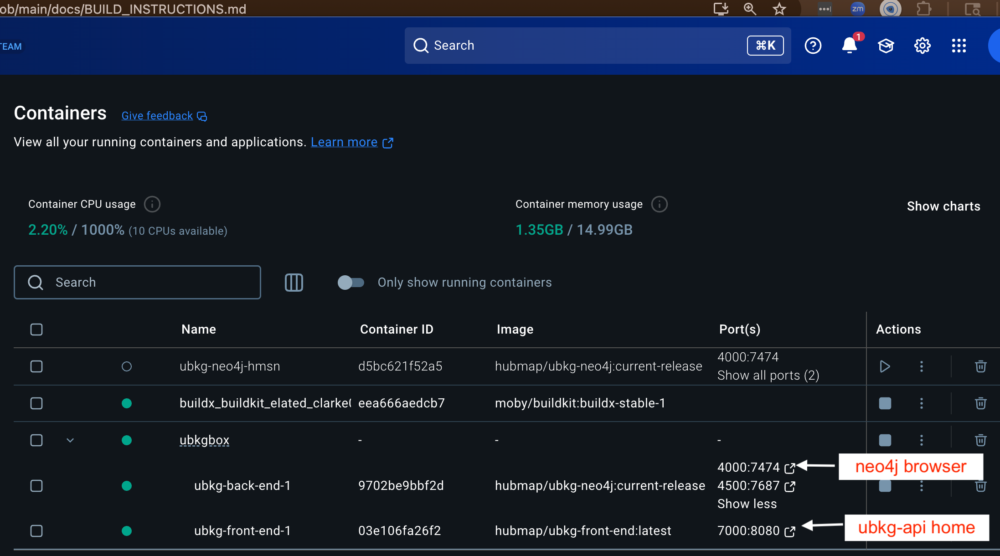

# Unified Biomedical Knowledge Graph (UBKG)

## Building a UBKGBox deployment
### (including integrating ubkg-neo4j)

**[UBKGBox](https://github.com/x-atlas-consortia/ubkg-box)** is a Docker Compose
multi-container application integrating:
- a **ubkg-back-end** service hosting an instance of a UBKG context in neo4j
- a **ubkg-front-end** service hosting a number of UBKG clients, including an instance of ubkg-api.

The **UBKGBox** workflows uses files used in the workflow to create the turnkey Docker distribution.

Scripts and Docker Compose YMLs in this repository can be used to build a distribution of **UBKGBox**.

# Supported platforms
The bash shell scripts contained in this directory are intended for use on Mac OS X or Linux. 
These scripts will not work on Windows. 
(The resulting Docker images should, however, run on Windows.)

# Workflow Setup

## Local UBKG neo4j Docker
The **ubkg-back-end** service of the **UBKGBox** application is a Docker container built from 
the [turnkey UBKG neo4j process](https://github.com/x-atlas-consortia/ubkg-neo4j/blob/main/docs/BUILD_INSTRUCTIONS.md).
In particular, the service uses both the Docker image from that workflow and the external bind mounts, including
the instance of the UBKG neo4j database.

## Files and directories

The **UBKGBox** Docker Compose configuration requires files and directories
from multiple GitHub repositories. Copy the files to the directory used to build the 
turnkey UBKG Docker distribution.

### container.cfg
The **container.cfg** file is used in both the workflow to generate the turkey Docker distribution and the **UBKGBox** workflow.

### build_ubkgbox.sh
Copy **build_ubkgbpx.sh** to the directory used to build the turnkey Docker distribution.
Set permissions on the file with the command `chmod +x build_ubkgbox.sh`.

### docker-compose.yml
The **docker-compose.yml** file in the _/docker_ directory is used to 
generate the **UBKGBox** multi-container application.

### ubkg-api instance's app.cfg file
The **ubkg-front-end** container hosts an instance of the ubkg-api which
is configured by an **app.cfg** file. The **app.cfg** file can be created from the **app.cfg.example** file 
in the ubkg-api's [src](https://github.com/x-atlas-consortia/ubkg-api/tree/main/src/ubkg_api/instance) directory.

The **UBKGBox** application assumes that the **app.cfg** file resides in a subdirectory of the build directory named _cfg_.

#### API resource management features
It is possible to configure the instance of the ubkg-api instance in the **ubkg-front-end** service container 
to manage API resources by setting values of keys in the external **app.cfg** file. 

For instructions to configure query management, consult the README.md in the ubkg-api repository, notably:
- [Optional Timeout Feature](https://github.com/x-atlas-consortia/ubkg-api/tree/main?tab=readme-ov-file#optional-timeout-feature)
- [Payload Size Limitation with Optional S3 Redirect](https://github.com/x-atlas-consortia/ubkg-api/tree/main?tab=readme-ov-file#payload-size-validation-with-optional-s3-redirection)

The **app.cfg** file for the instance of ubkg-api in the **ubkg-front-end** service container
will, by default, not implement query management features of the ubkg-api, including:
- query timeout
- response payload size limitation
- S3 redirect of large payload

#### SERVER key
The value of the SERVER key in **app.cfg** is a URI that the ubkg-api component of the 
**ubkg-front-end** service passes to the neo4j.Graphdatabase.Driver.

The format for SERVER depends on the application environment for the neo4j instance:
1. If the neo4j instance is running locally, SERVER should be bolt://localhost:7687.
2. If the neo4j instance is running in a local Docker container application (i.e., the turnkey Docker distribution), SERVER
   should be in format bolt://localhost:_PORT_, where _PORT_ is the host port that was
   assigned to container port 7687.
3. If the neo4j instance is running in a Docker container that is part of a Docker
   Compose multi-container application (i.e., **UBKGBox**, , SERVER should be format bolt://_IMAGE_:7687,
   where _IMAGE_ is the Docker image name of the container that hosts the neo4j instance. In UBKGBox, _IMAGE_ is **ubkg-back-end**.

# UBKGBox Workflow

1. Open a Terminal window. 
2. Navigate to the build directory. 
3. Build a turnkey Docker distribution of ubkg-neo4j, as described [here](https://github.com/x-atlas-consortia/ubkg-neo4j/blob/main/docs/BUILD_INSTRUCTIONS.md). 
4. Execute `./build_ubkgbox.sh up`. The script will:
   - validate and obtain information from _container.cfg_.
   - copy **app.cfg** from the _cfg_ folder to a folder named _app_instance_.
   - execute Docker Compose 
5. Docker Compose will build a container application named **ubkg_box*, with service-containers named
- **ubkg-front-end-1**
- **ubkg-back-end-1**

Docker Compose will display messages to the Terminal window as it executes, showing status messages from Docker containers named **ubkg-back-end-1** and **ubkg-front-end-1**.
The messages from **ubkg-back-end-1** will be identical to those displayed during the build of the turnkey Docker distribution.

The Container view of Docker Desktop will show:
- a container named _ubkgbox_
- subcontainers named _ubkgbox-back-end-1_ and _ubkgbox-front-end-1_

Container ports will have the following links:
- ubkg-front-end-1:8080 - to the root page of the ubkg-api instance running in **ubkg-front-end-1**
- ubkg-back-end-1:7474 - to the neo4j browser page for the neo4j instance running in **ubkg-back-end-1**

